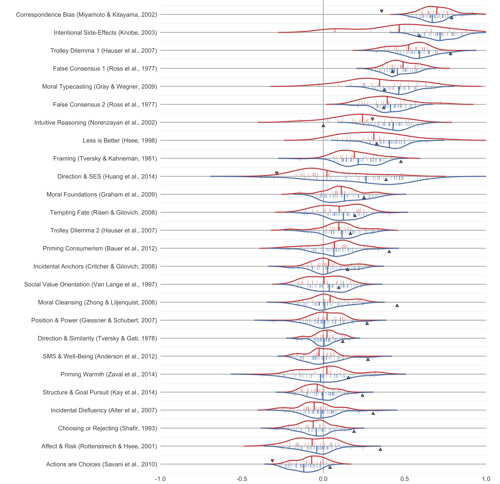
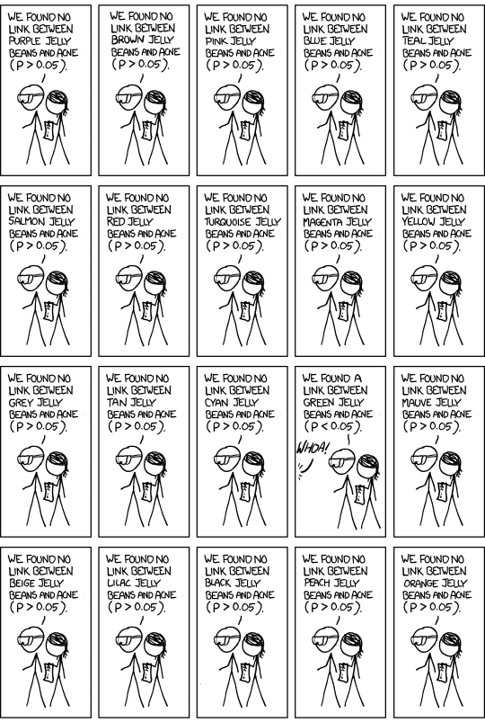
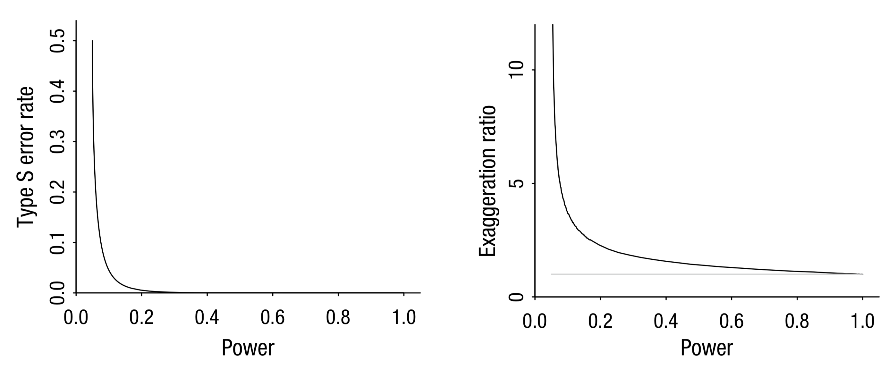
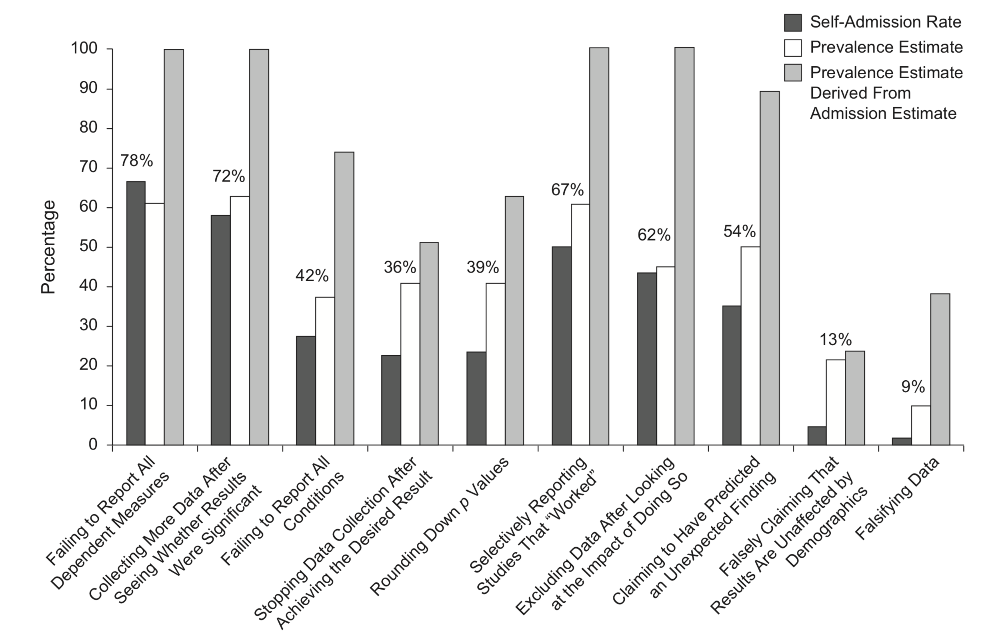
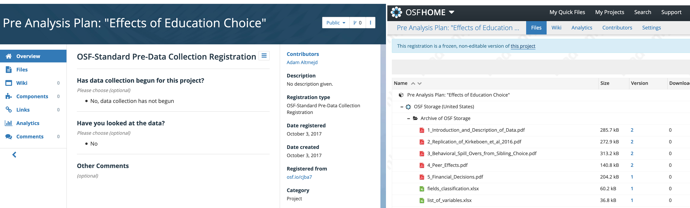
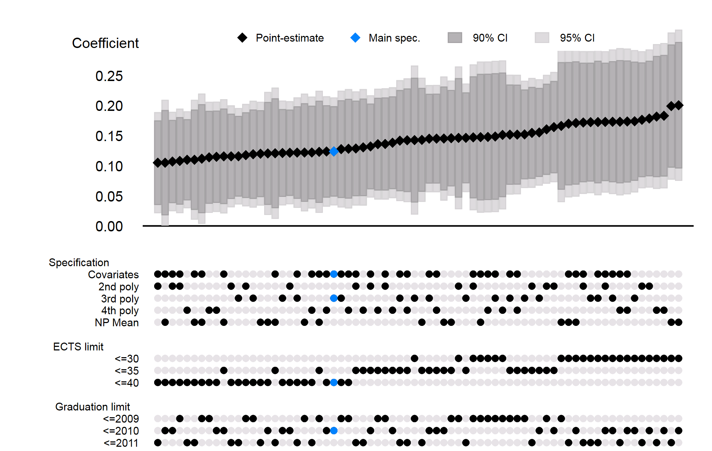

```{r setup,echo=FALSE,include=FALSE,cache=FALSE}
library(rmarkdown)
library(knitr)
library(data.table)
library(pander)
library(ggplot2)
library(RColorBrewer)
opts_chunk$set(cache.path = "assets/cache", fig.path = "assets/img/knitr_")
```

---

1. The replication crisis
2. The problem
3. What to do about it

# Part 1<br>---<br>The Replication Crisis

---

<p class="stretch"></p>

<footer>Original: @Carney2010_power_posing. Replication: @Ranehill2015_assessing_robustness.</footer>

::: notes
The **power posing** study found that taking a power pose does
not only increase self-assessed power, but actually increases testosterone,
i.e. having a chemical response that makes you  more powerful. While the
increased feeling of power does reproduce, the hormonal response does not.
:::

---

<p class="stretch"></p>

<footer>Original: @Bateson2006_cues_being. Replication: @Northover2017_artificial_surveillance.</footer>

::: notes
In this study the researchers posted notes of either "watchful eyes" or flowers
above a cookie jar in the common kitchen, alternating every week. They find that
the eyes increases honest behavior. Weeks with eyes had money closer to the
expected amount if everyone paid for themselves.
:::

---

<p class="stretch"></p>

<footer>Original: @Caruso2013_mere_exposure. Replication: @Klein2014_investigating_variation.</footer>

::: notes
In this study subjects answered questions about social justice, treatment group
saw the questions on a computer screen where the background image showed a dollar
bill. They more strungly justified the current social system.
:::

---

<p class="stretch"></p>

<footer>Original: @Zhong2006_washing_away. Replication: @Earp2014_out_damned.</footer>

::: notes
The "Macbeth" study. Here subjects first transcribed a story. Treated subjects
transcribed an immoral (sabotaging for a co-worker) story, written in first
person. They then answered questions about how much they wanted different
products, among them cleaning products.
:::

---

<p class="stretch"></p>

<footer>Original: @Strack1988_inhibiting_facilitating. Replication: @Wagenmakers2016_registered_replication.</footer>

::: notes
In this study, subjects had to watch a funny movie with a pen in their mouth.
Treated subjects had to hold the pen with their teeth, while control subjects
helt it with their lips. Holding the pen with your teeth forces the mouth into
a smile-like position. Afterwards subjects rated how fun they thought the movie
was. Pen-in-teeth subjects thought the movie was funnier.
:::

## Science/Nature Replications

<p class="stretch"></p>

<footer>@Camerer2018_evaluating_replicability</footer>

::: notes
Results from replication projects:<br>
- 36/100 [RPP](https://osf.io/ezcuj/)<br>
- 11/18 [EERP](https://osf.io/bzm54/)<br>
- 13/21 [SSRP](https://osf.io/pfdyw/)<br>
- [ML1](https://osf.io/wx7ck/): 13 effects 36 samples (N=6344), 2 failed - about sample heterogeneity countries<br>
- [ML2](https://osf.io/8cd4r/): 28 effects, 125 samples (N=15305), 13 failed, much more heterogeneity in failed replications, no difference with country WIERD status<br>
- [ML3](https://osf.io/ct89g/): 10 effects in 20 pools (N=2696+737), 7 failed - heterogeneity time of semester<br>
- [ML4](https://osf.io/8ccnw/): Replicating "Terror Management Theory" in different settings<br>
- [ML5](https://osf.io/7a6rd/): investigates pre data collection peer review of 10 "non-endorsed" RPP protocols, testing direct replication vs "improved protocol"<br>
- Registered Replication Reports ?/?
:::

## Replication Heterogeneity

<p class="stretch"></p>

<footer>@Klein2018_many_labs</footer>

::: notes
Totally 125 labs participated with 15k subjects, 28 effects (all expert reviewed).
In plot, small bars indicate results from each lab. Main takeaway: variation exists,
but most effects either replicate or not. No matter the country or other (unobserved?)
lab-specific variation. Grey triangle shows WIERD sample, empty triangle less WIERD.
:::

## P-Hacking in Economics

<p class="stretch"></p>

<footer>@Brodeur2016_star_wars</footer>

::: notes
Plots show distribution of **z-stats** in AER, QJE, JPE. Total sample 50k tests.
Camel shape of missing p-values is p-hacking to get p-stats just below 0.05.
Publication bias is downward-slope over whole distribution.
"Eye-catchers" refers to the use of stars to make significant results salient.
:::

## Power in Economics

- 64,076 in 6,700 studies
- Median power 18%
- 80% of effects exaggerated (x2)

<footer>@Ioannidis2017_power_bias</footer>

::: notes
@Ioannidis2017_power_bias
"We survey 159 empirical economics literatures that draw upon 64,076 estimates
of economic parameters reported in more than 6,700 empirical studies. Half
of the research areas have nearly 90% of their results under‐powered.
The median statistical power is 18%, or less. A simple weighted average of
those reported results that are adequately powered (power ≥ 80%) reveals
that nearly 80% of the reported effects in these empirical economics
literatures are exaggerated; typically, by a factor of two and with
one‐third inflated by a factor of four or more."
:::

## IV is not reliable

- 1359 IV regressions from 31 AEA papers

<p class="stretch"></p>

<footer>@Young2019_consistency_inference</footer>

::: notes
@Young2019_consistency_inference
1359 IV regressions from 31 papers published in AEA journals. Non-iid errors bias IV, leading to very low power and MSE i almost always lower than the biased OLS. Weak-instrument tests do not work. Significance comes from 1-2 outliiers.
:::

## Why Should we Care?

For science:

> "non-reproducible single occurrences are of no significance to science"

For our careers:

> "I have spent nearly a decade working on the concept of ego depletion [...] The problem is that ego depletion might not even be a thing."

<p class="stretch">&nbsp;</p>

<footer>@Popper2005_logic_scientific, @Inzlicht2016_reckoning</footer>

## Impact

<p class="stretch"></p>

::: notes
The vaccines cause autism-paper is the absolute worst case of when bad science
has horrible consequences. Having been disproven twenty years ago, and
retracted for at least a decade, it is still widely shared and cited as a
cause to not vaccinate. While it is a case of grave scientific misconduct,
its publication might have been avoided in an "open science" research culture.
:::

## The Goal

Produce **reproducibile** research that can be *replicated easily*.

- **Reproduction**: Re-analyze with push of a button.
- **Direct Replication**: internal validity
- **Conceptual Replication**: external validity

# Part 2<br /> --- <br />The Problem

---

1. **Publication Bias**
2. **Forking (p-hacking)**
3. **Low Statistical Power**
4. **Scientific Misconduct**

---

<p class="stretch"></p>

<footer>@Munafo2017_manifesto_reproducible</footer>

## Publication Bias

*Published research is not representative.*

- Hard to assess knowledge
- Incentive to p-hack

## The File Drawer

```{r franco_plot, include=FALSE}
dt <- data.frame(
  Evidence = c("Null Results", "Null Results", "Null Results", "Null Results",
               "Mixed Results", "Mixed Results", "Mixed Results", "Mixed Results",
               "Strong Results", "Strong Results", "Strong Results", "Strong Results"),
  Result = c("Not written", "Written but not published", "Published (non-top-tier)", "Published (top-tier)",
             "Not written", "Written but not published", "Published (non-top-tier)", "Published (top-tier)",
             "Not written", "Written but not published", "Published (non-top-tier)", "Published (top-tier)"),
  Value = c(0.646, 0.146, 0.104, 0.104,
            0.122, 0.390, 0.378, 0.110,
            0.044, 0.341, 0.384, 0.231)
)

g <- ggplot(data=dt, aes(x = factor(Evidence, levels = c("Null Results", "Mixed Results", "Strong Results")),
                         fill = factor(Result, levels = c("Published (top-tier)", "Published (non-top-tier)", "Written but not published", "Not written")),
                         y = Value, )) +
  geom_bar(stat = "identity") +
  theme_light() +
  theme(legend.position = "right",
        legend.title = element_blank(),
        axis.title = element_blank()) +
  scale_y_continuous(labels = scales::percent_format(accuracy = 1)) +
  scale_fill_brewer(palette="Set3")
print(g)
```

<p class="stretch"></p>

<footer>@Franco2014_publication_bias</footer>

::: notes
Paper analyzes 200 experiments in Social Sciences (mainly Pol Sci, Psych and Soc).
Uses TESS (Time-Sharing Experiments in the Social Sciences).  All experiments
peer reviewed, done by same analytics firm, requires power calculation. Likely
lower bound of all research.
:::

## What is a P-value?

<p class = "fragment">*Under the null*, how **likely** is the observed data?</p>

<p class = "fragment">Says **nothing** about assumptions+hypothesis validity.</p>

::: notes
Imagine you have a coin and want to determine if its fair or not. We set a=0.05.
This gives us a rejection region (with a=0.05) at 0,1,9,10 heads in 10 flips.
Seeing 9 heads in a trial has a p-value of ~0.02. We reject the null because
if the null was true, our data would be too unlikely.<br>
Notice how this doesn't say anything about whether the null is true or not. Or
about the actual fairness of the coin. If the coin is actually not fair, the
likelyhood we would observe the data depends on its bias.<br>
Remembering that p-values don't validate hypothesis might make it easier to
stop relying so much on them.
:::

---

<p class="stretch"></p>
<footer>@Nuzzo2014_scientific_method</footer>

::: notes
Depending on original odds "likelihood to observe effect" can vary greatly.
Figure can be understood as follows: p-value gives likelihood to observe data
under null, but is the effect (alternative hypothesis) true? We study a
hypothesis thats really unlikely (long-shot) and observe some data. The data
is so extreme that it would be unlikely under the null, so we reject H0. But
because the hypothesis was really unlikely to start with, this just changes our
prior of 10% to a posterior of 11%.
:::

## Forking, P-hacking, Fishing, Researcher Degrees of Freedom

---

<p class="stretch"></p>

---

<p class="stretch"></p>

---

<p class="stretch"></p>


## Forking Paths

<p class = "fragment">Even with a pre-stated hypothesis and no <i>conscious</i> p-hacking, each design choice is a <i>fork in the path</i> towards a finished paper.
</p>

<p class = "fragment">If observed significance influences these choices, <b>p-values are meaningless</b>.</p>

<footer>@Gelman2013_garden_forking</footer>

## Forking Checklist

<p class="stretch"></p>

<footer>@Wicherts2016_degrees_freedom</footer>

## Low Statistical Power

- Even with registries, subgroups can get small
- Empirical Economics: median power 18%
- Type-M/S errors:

<p class="stretch"></p>

<footer>@Gelman2014_power_calculations, @Ioannidis2017_power_bias</footer>

::: notes
@Ioannidis2017_power_bias
"We survey 159 empirical economics literatures that draw upon 64,076 estimates
of economic parameters reported in more than 6,700 empirical studies. Half
of the research areas have nearly 90% of their results under‐powered.
The median statistical power is 18%, or less. A simple weighted average of
those reported results that are adequately powered (power ≥ 80%) reveals
that nearly 80% of the reported effects in these empirical economics
literatures are exaggerated; typically, by a factor of two and with
one‐third inflated by a factor of four or more."
:::

## Scientific Misconduct

- Uncommon, but not as rare as you think
- Hard to fix, need strong norms

---

<p class="stretch"></p>
<footer>@John2012_measuring_prevalence</footer>

::: notes
Bayesian truth serum incentives for truthtelling. Each participant is surveyed
bout (a) their own questionable research practice (QRP), (b) their percieved
prevalence in the population and (c) their belief about others likelihood
to admit.
:::

# Part 3 <br>---</br> What can you do?

## Study Registration

Public demonstration of precedence

**Pre**-registration --- *Before* accessing data

- combats file-drawer
- protects against forking
- fends off reviewer no. 2

## OSF Registration

<p></p>

- [OSF.io](http://osf.io) registration by *freezing* a project.
- Or: [AEA RCT Registry](https://www.socialscienceregistry.org/), [AsPredicted](https://aspredicted.org/), [EGAP Registry](http://egap.org/content/registration)

::: notes
OSF registration is great. Much freer than others, not as specific to
experimental work. Can include analysis plan, code files, pilot data, etc.
:::

## Pre-Analysis Plan

*Pick a path through the garden and stick to it.*

Focus: sample selection, estimation

Also: motivation, literature

Could be: your paper before results <br>(maybe extension of grant proposal)

::: notes
Like @Coffman2015_preanalysis_plans argue, pre-analysis plans are even more
important in empirical work, where replication is often hard or impossible. If
all the data is already used, we can't just generate more by running another
experiment.

Most important to tie hands with regards to forking. Pick one path
in the garden and stick to it. See check list.
But can also be useful to include motivation, literature review etc to claim a
position in the research literature and explain all the research design choices.
:::

## Register a Pre-Analysis Plan

- Ideal: registration *outputs final results*, <br>will not work with empirical research.
- Vague PAP is better than nothing.
- Consider putting X% of data in *lock-box*.

::: notes
With empirical work it is almost impossible to figure everything out before
looking at the data. Instead it can be really useful to adopt a lock-box approach.
(1) Write a pre-analysis plan with everything you know and register it. Then take
half (if possible) or as little as a few observations if you are worried about power,
out of the lock box. Do the analysis, fix all the unexpected errors,
do as much data exploration as you want. Then register another version of the
PAP (at this point it might almost be a paper). Only then do you use the rest
of the data.

In Sweden, Statistics Sweden could provide the lock box as they deliver all data.
Just tell them you only want them to share x% with you.
:::

## PAP Example 1

<p class="stretch"></p>

<footer>@Altmejd2017_pre_analysis</footer>

## PAP Example 2

<p class="stretch"></p>
<footer>@Altmejd2017_pre_analysis</footer>

## PAP Example 3

<p class="stretch"></p>
<footer>@Altmejd2017_pre_analysis</footer>

## Pre-analysis Plans: A Stocktaking

- 195 development PAPs (AEA, EGAP, -2016)
- PAPs specify:
  - Clear hypothesis (90%)
  - $>5$ hypotheses (58%)
  - Statistical models (68%)
  - Attrition (25%)
  - Outliers (8%)

<footer>@Ofosu2019_preanalysis_plans</footer>

::: notes
195 PAPs from EGAP and AEA, mostly development. 63% field experiment, 27% survey, 4% lab and 4% observational. Outcomes often well specified, not control variables and only 68% spell out statistical model and a minority talk about attrition, outliers and treatment imbalance.
:::

## In 93 papers:

- 25% of PAP hypotheses not reported
- 18% additional tests<br>(82% do not mention PAP adherence)
- Why? No policing equilibrium.

<footer>@Ofosu2019_preanalysis_plans</footer>

::: notes
93 papers have been published. 25% of hypotheses are not included and 82% of papers that include additional hypothesis do not mention that these were not included in the PAP.

People think PAPs are costly 26% say it took more than a month, but also worth it an rewarding. And 52% say they experience (large) downstream time saving. "I almost always deviate from the PAP in order to make a paper that makes sense."
:::

##

> I’ve gotten an absurd number of requests for sensitivity analyses for strictly pre-specified empirical work. The existing norm appears to keep me from looking for unexpected results while providing no protection from readers or reviewers who want to dig through the data trying to kill off empirical results they don’t agree with.

<footer>@Ofosu2019_preanalysis_plans</footer>

::: notes
But 46% of users have invoked PAPs to respond to editors.
:::

## Specification Curve

If you cannot *pre*-pick one analysis, study **all**.

<footer>@Simonsohn2015_specification_curve</footer>

::: notes
Also known as multiverse analysis [@Steegen2016_increasing_transparency].
:::

## Birth Order

### Self-Reported Intellect

<p class="stretch"></p>

<footer>@Rohrer2017_probing_birthorder</footer>

::: notes
Birth order effects on self-reported intellect. Here we see a clear positive effect,
with most specifications being significant in the same direction. There also
doesn't seem to exist any systematic reason for non-significance.
:::

## Birth Order

### Positive Reciprocity

<p class="stretch"></p>

<footer>@Rohrer2017_probing_birthorder</footer>

::: notes
Birth order effects on positive reciprocity. Here on the other hand there does
not seem to exist any relationship. Effects are distrubted in both directions. Most
significant effects are negative, but not many are significant. Only sibships of 2,
with close (but not too close) age difference. Effect is only visible in
within-family analysis, but what does this even mean in a family of two siblings?
:::

## Another curve

### What is the signaling value of GPA?

<p class="stretch"></p>

<footer><https://github.com/hhsievertsen/speccurve></footer>

::: notes
From not yet published paper by Hans Sievertsen.
:::

## A Reproducibility-Enhancing Research Workflow

## Data Management

- Never edit raw input data directly
- Keep processed data in separate folder

<p class="stretch"></p>

## Reproducible Code

- *Self-documenting* code: naming, structure, formatting
- Each code file has separate purpose
- Use comments when needed
- Use functions/programs, never write same code twice
- Literate programming in *RMarkdown*

::: notes
Comments should often not be needed if code speaks for itself. Don't worry about
long variable names. Prioritize legibility over smaller files or efficient code,
to the extent possible. Ensure that someone else can understand what your code
does.

File naming and folder structure is super important. Always use documentation
headers at the top of code files that explain what the file does. Try to divide
separate parts of data processing/analysis into different files. Maybe one file
processes raw data on occupational changes, another identifies family connections,
and a third joins the two first.
:::

## Example

```{r}
rowmeans <- function(x, y) {
  # Calculate pairwise means of numeric input vectors.
  # Input: two vectors of equal length; "x", "y"
  # Output: one vector "out" of means.

  if (length(x) != length(y)) stop("x, y have unequal lengths")

  # Create empty vector to fill with rowmeans
  out <- vector("numeric", length = length(x))

  for (i in seq_along(x)) {
    # For each row, calculate mean of x and y and store in z.
    out[i] <- mean(c(x[i], y[i]))
  }

  return(out)
}
```

## Version Control

- *Annotated* history of changes
- Documents progress in research
- Keep track of latest version
- Collaborate efficiently, reconcile conflicts
- Only works with text files, not Word

## Version Control in Github

- Git is opensource VCS, hosted by Github
- One *repository* per project
- Changes tracked through *commits*
- Link to OSF, freeze for registration

<footer>Tip: Register for [Github Education](https://education.github.com)</footer>

::: notes
Git is the open source software that Github uses. One does not need github really,
but it is very useful for beginners, especially together with their Github Desktop
app and when collaborating with others as Github can host your repository.<br>
A repository is a folder that houses your project. Git creates a hidden folder
called .git in which all your changes are tracked.<br>
When working with Git, commit often, but not too often. Each commit should have
a specific purpose, e.g. "accounted for inflation in income measures" or
"new version of table 4".<br>
Remember that when working with sensitive data, you most likely cannot store your
data in your git repository. Use the .gitignore file to exclude the raw data if
needed, or self-host your remote repository on a secure server.
:::

## Github Desktop

<p class="stretch"></p>

## Data Sharing

- Without data, reproduction is impossible
- Never compromise privacy
- Alternatives: retrieval protocol, data store

<footer>Swedish registry data: [Swedish National Data Service, SND](https://snd.gu.se/en)</footer>

::: notes
For someone to reproduce our research they need access to the data. But we often
cannot share data for e.g. ethical reasons. Working with registry data we have
two options. We can share a detailed specification of exactly what registries we
use, including names of all variables so that the researcher reproducing our work
can submit their own ethics application, buy the data from SCB and redo the study.
This would be really expensive though. Instead, a better option (although I'm not
sure if it actually works) is to store the registry data at SND and allow
other researchers to analyze it without having access to view the actual data.
:::

## Institutional Change

- use results-blind review,
- require study registration,
- require data publication,
- require reproducible code.

::: notes
Change already well underway, but needs strong advocates. [JDE has results blind review](https://medium.com/center-for-effective-global-action/pre-results-review-at-the-journal-of-development-economics-taking-transparency-in-the-discipline-cc1e7e74182a).
AER requires development but not lab experiments to be registered.
Another example are the Open Science Badges that more and more journals are
using, and that seem to really work [@Kidwell2016_badges_acknowledge]
:::

# Readings

* [Transparent and Reproducible Social Science Research](https://www.ucpress.edu/book/9780520296954/transparent-and-reproducible-social-science-research) [@Christensen2019_transparent_reproducible]
* [Code and Data](https://web.stanford.edu/~gentzkow/research/CodeAndData.pdf) [@Gentzkow2014_code_data]
* [Best Practices Manual](https://github.com/garretchristensen/BestPracticesManual/blob/master/Manual.pdf) [@Christensen2018_manual_best]

# Thank you!

<adam@altmejd.se>

# References {.allowframebreaks}
