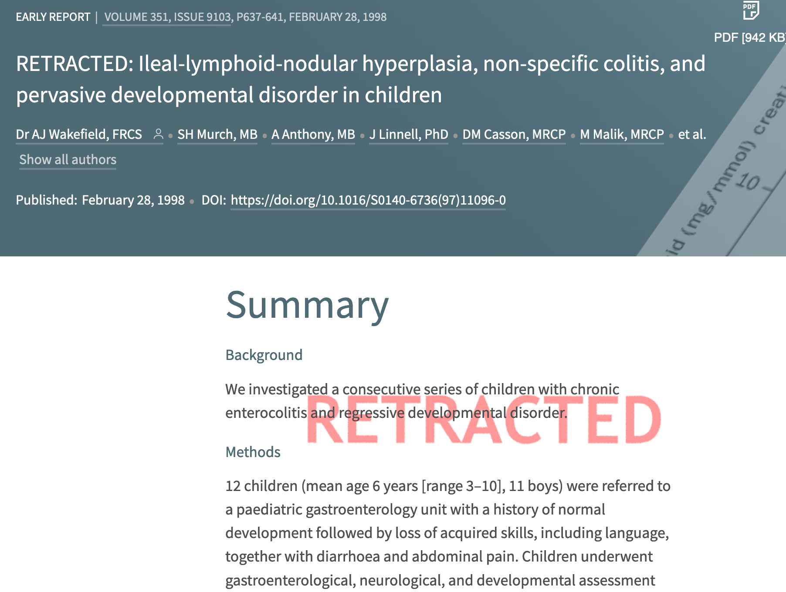
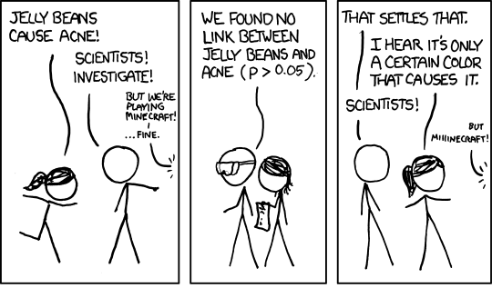
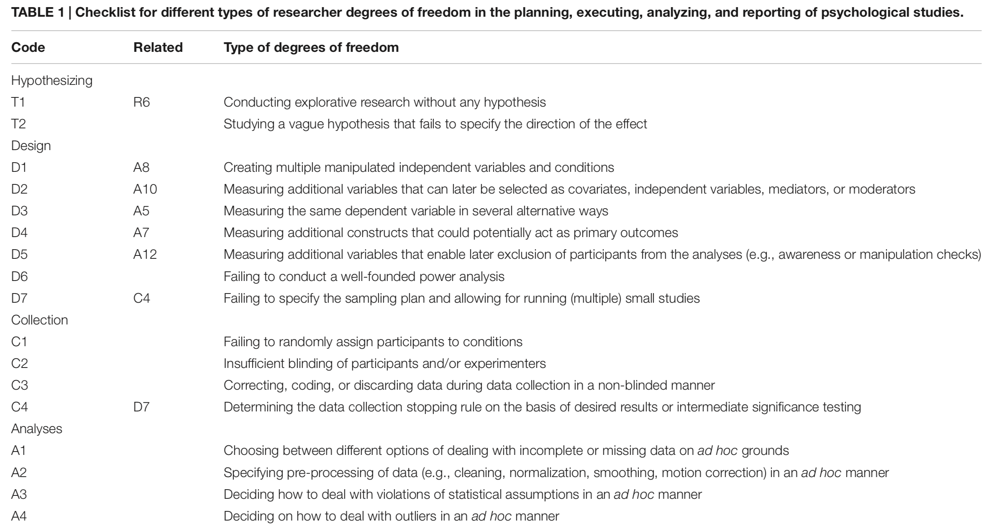
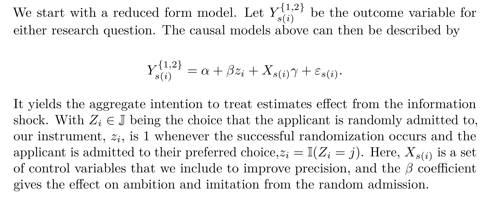
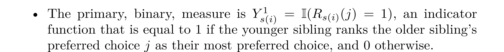
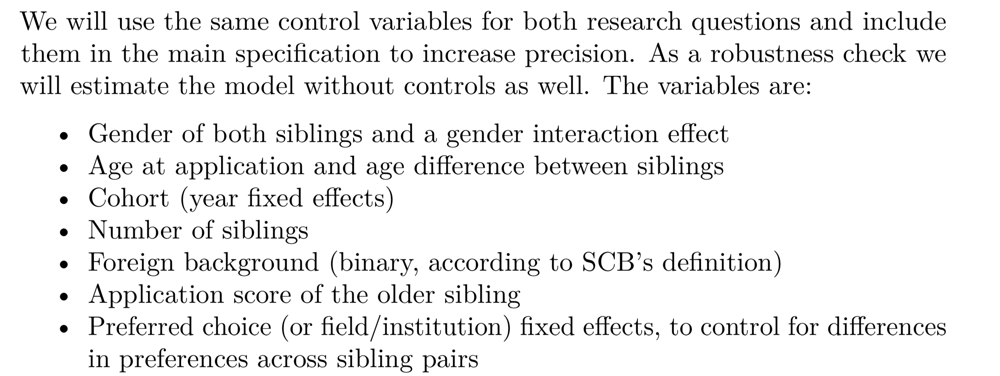
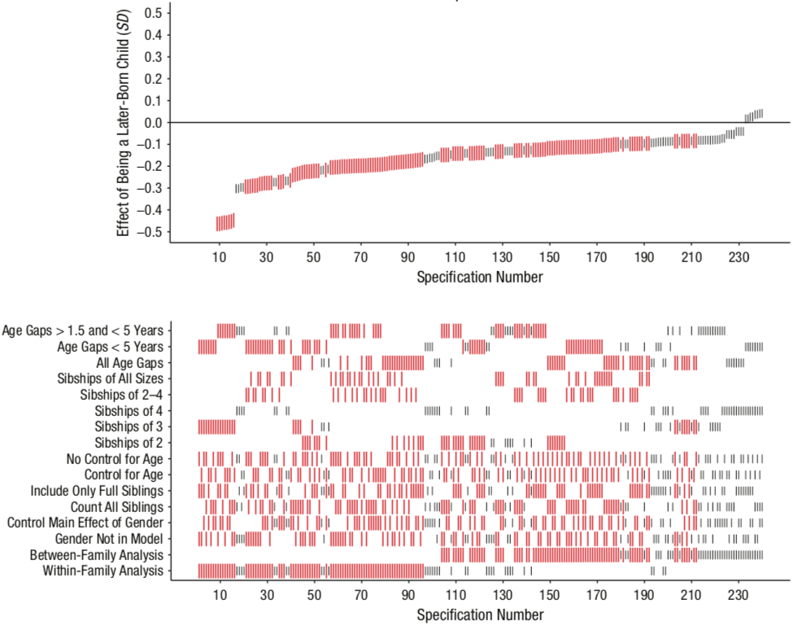

Open Science & Reproducibility
==============================

May 2nd, 2019

Adam Altmejd

<a href="mailto:adam@altmejd.se" class="email">adam@altmejd.se</a>

===1===

1.  The replication crisis
2.  The problem
3.  What to do about it

===1===

Part 1 — The Replication Crisis
-------------------------------------

===1===

<footer>
Original: Carney, Cuddy, and Yap (2010). Replication: Ranehill et al.
(2015).
</footer>
<aside class="notes">
The power posing study found that taking a power pose does not only
increase self-assessed power, but actually increases testosterone,
i.e. having a chemical response that makes you more powerful. While the
increased feeling of power does reproduce, the hormonal response does
not.
</aside>

===1===

<footer>
Original: Bateson, Nettle, and Roberts (2006). Replication: Northover et
al. (2017).
</footer>
<aside class="notes">
In this study the researchers posted notes of either “watchful eyes” or
flowers above a cookie jar in the common kitchen, alternating every
week. They find that the eyes increases honest behavior. Weeks with eyes
had money closer to the expected amount if everyone paid for themselves.
</aside>

===1===

<footer>
Original: Caruso et al. (2013). Replication: Klein et al. (2014).
</footer>
<aside class="notes">
In this study subjects answered questions about social justice,
treatment group saw the questions on a computer screen where the
background image showed a dollar bill. They more strungly justified the
current social system.
</aside>

===1===

<footer>
Original: Zhong and Liljenquist (2006). Replication: Earp et al. (2014).
</footer>
<aside class="notes">
The “Macbeth” study. Here subjects first transcribed a story. Treated
subjects transcribed an immoral (sabotaging for a co-worker) story,
written in first person. They then answered questions about how much
they wanted different products, among them cleaning products.
</aside>

===1===

<footer>
Original: Strack, Martin, and Stepper (1988). Replication: Wagenmakers
et al. (2016).
</footer>
<aside class="notes">
In this study, subjects had to watch a funny movie with a pen in their
mouth. Treated subjects had to hold the pen with their teeth, while
control subjects helt it with their lips. Holding the pen with your
teeth forces the mouth into a smile-like position. Afterwards subjects
rated how fun they thought the movie was. Pen-in-teeth subjects thought
the movie was funnier.
</aside>

===1===

### Science/Nature Replications

<footer>
Camerer et al. (2018)
</footer>
<aside class="notes">
Results from replication projects:  - 36/100
[RPP](https://osf.io/ezcuj/)  - 11/18
[EERP](https://osf.io/bzm54/)  - 13/21
[SSRP](https://osf.io/pfdyw/)  - [ML1](https://osf.io/wx7ck/): 13
effects 36 samples (N=6344), 2 failed - about sample heterogeneity
countries  - [ML2](https://osf.io/8cd4r/): 28 effects, 125 samples
(N=15305), 13 failed, much more heterogeneity in failed replications, no
difference with country WIERD status  - [ML3](https://osf.io/ct89g/):
10 effects in 20 pools (N=2696+737), 7 failed - heterogeneity time of
semester  - [ML4](https://osf.io/8ccnw/): Replicating “Terror
Management Theory” in different settings  -
[ML5](https://osf.io/7a6rd/): investigates pre data collection peer
review of 10 “non-endorsed” RPP protocols, testing direct replication vs
“improved protocol”  - Registered Replication Reports ?/?
</aside>

===1===

### Replication Heterogeneity

<footer>
Klein et al. (2018)
</footer>
<aside class="notes" data-markdown>
Totally 125 labs participated with 15k subjects, 28 effects (all expert
reviewed). In plot, small bars indicate results from each lab. Main
takeaway: variation exists, but most effects either replicate or not. No
matter the country or other (unobserved?) lab-specific variation. Grey
triangle shows WIERD sample, empty triangle less WIERD.
</aside>

===1===

### Why Should we Care?

For science:

> “non-reproducible single occurrences are of no significance to
> science”

For our careers:

> “I have spent nearly a decade working on the concept of ego depletion
> \[…\] The problem is that ego depletion might not even be a thing.”

 

<footer>
Popper (2005), Inzlicht (2016)
</footer>

===1===

### Impact

<aside class="notes">
The vaccines cause autism-paper is the absolute worst case of when bad
science has horrible consequences. Having been disproven twenty years
ago, and retracted for at least a decade, it is still widely shared and
cited as a cause to not vaccinate. While it is a case of grave
scientific misconduct, its publication might have been avoided in an
“open science” research culture.
</aside>

===1===

### The Goal

Produce <b>reproducibile</b> research that can be
<i>replicated easily</i>.

 
<ul class="fragment">
<li>
<b>Reproduction</b>: Re-analyze with push of a button.
</li>
<li>
<b>Direct Replication</b>: internal validity
</li>
<li>
<b>Conceptual Replication</b>: external validity
</li>
</ul>

===1===

### Discussion

Is there a replication crisis for Sociology?

===1===

Part 2  —  The Problem
--------------------------------

===1===

1.  **Publication Bias**
2.  **Forking (p-hacking)**
3.  **Low Statistical Power**
4.  **Scientific Misconduct**

===1===

<footer>
Munafò et al. (2017)
</footer>

===1===

### Publication Bias

<i>Published research is not representative.</i>

<ul class="fragment">
<li>
Hard to assess knowledge
</li>
<li>
Incentive to p-hack
</li>
</ul>

===1===

### The File Drawer

<footer>
Franco, Malhotra, and Simonovits (2014)
</footer>
<aside class="notes" data-markdown>
Paper analyzes 200 experiments in Social Sciences (mainly Pol Sci, Psych
and Soc). Uses TESS (Time-Sharing Experiments in the Social Sciences).
All experiments peer reviewed, done by same analytics firm, requires
power calculation. Likely lower bound of all research.
</aside>

===1===

### Forking, P-hacking, Fishing, Researcher Degrees of Freedom

===1===

===1===

===1===

===1===

### P-Hacking in Economics

<footer>
Papers in Economics, Brodeur et al. (2016)
</footer>
<aside class="notes" data-markdown>
Plots show distribution of **z-stats** in AER, QJE, JPE. Total sample
50k tests. Camel shape of missing p-values is p-hacking to get p-stats
just below 0.05. Publication bias is downward-slope over whole
distribution. “Eye-catchers” refers to the use of stars to make
significant results salient.
</aside>

===1===

### Forking Paths

Even with a pre-stated hypothesis and no <i>conscious</i> p-hacking,
each design choice is a fork in the path towards a finished paper.

If observed significance influences these choices,  <b>p-values are
meaningless</b>.

<footer>
Gelman and Loken (2013)
</footer>

===1===

### Forking Checklist

<footer>
Wicherts et al. (2016)
</footer>

===1===

### What is a P-value?

*Under the null*, how **likely** is the observed data

Says **nothing** about assumptions+hypothesis validity

<aside class="notes">
Imagine you have a coin and want to determine if its fair or not. We set
a=0.05. This gives us a rejection region (with a=0.05) at 0,1,9,10 heads
in 10 flips. Seeing 9 heads in a trial has a p-value of ~0.02. We reject
the null because if the null was true, our data would be too
unlikely.  Notice how this doesn’t say anything about whether the
null is true or not. Or about the actual fairness of the coin. If the
coin is actually not fair, the likelyhood we would observe the data
depends on its bias.  Remembering that p-values don’t validate
hypothesis might make it easier to stop relying so much on them.
</aside>

===1===

<footer>
Nuzzo (2014)
</footer>
<aside class="notes">
Depending on original odds “likelihood to observe effect” can vary
greatly. Figure can be understood as follows: p-value gives likelihood
to observe data under null, but is the effect (alternative hypothesis)
true? We study a hypothesis thats really unlikely (long-shot) and
observe some data. The data is so extreme that it would be unlikely
under the null, so we reject H0. But because the hypothesis was really
unlikely to start with, this just changes our prior of 10% to a
posterior of 11%.
</aside>

===1===

### Low Statistical Power

-   Even with registries, subgroups can get small
-   Empirical Economics: median power 18%
-   Type-M/S errors:
    

    
    

    <footer>
    Gelman and Carlin (2014), Ioannidis, Stanley, and
    Doucouliagos (2017)
    </footer>

<aside class="notes">
Ioannidis, Stanley, and Doucouliagos (2017) “We survey 159 empirical
economics literatures that draw upon 64,076 estimates of economic
parameters reported in more than 6,700 empirical studies. Half of the
research areas have nearly 90% of their results under‐powered. The
median statistical power is 18%, or less. A simple weighted average of
those reported results that are adequately powered (power ≥ 80%) reveals
that nearly 80% of the reported effects in these empirical economics
literatures are exaggerated; typically, by a factor of two and with
one‐third inflated by a factor of four or more.”
</aside>

===1===

### Scientific Misconduct

-   Uncommon, but not as rare as you think
-   Hard to fix, need strong norms

===1===

<footer>
John, Loewenstein, and Prelec (2012)
</footer>
<aside class="notes">
Bayesian truth serum incentives for truthtelling. Each participant is
surveyed bout (a) their own questionable research practice (QRP), (b)
their percieved prevalence in the population and (c) their belief about
others likelihood to admit.
</aside>

===1===

### Discussion

What are the main problems in Sociology?

===1===

Part 3  —  What can you do?
=====================================

===1===

### Study Registration

Public demonstration of precedence

<b>Pre</b>-registration — <em>Before</em> accessing data

<ul>
<li>
combats file-drawer
</li>
<li>
protects against forking
</li>
<li>
fends off reviewer no. 2
</li>
</ul>

===1===

### OSF Registration

-   [OSF.io](http://osf.io) registration by *freezing* a project.
-   Or: [AEA RCT Registry](https://www.socialscienceregistry.org/),
    [AsPredicted](https://aspredicted.org/), [EGAP
    Registry](http://egap.org/content/registration)

<aside class="notes">
OSF registration is great. Much freer than others, not as specific to
experimental work. Can include analysis plan, code files, pilot data,
etc.
</aside>

===1===

### Pre-Analysis Plan

*Pick a path through the garden and stick to it.*

Focus: sample selection, estimation

Also: motivation, literature

Could be: your paper before results  (maybe extension of grant
proposal)

<aside class="notes">

Like Coffman and Niederle (2015) argue, pre-analysis plans are even more
important in empirical work, where replication is often hard or
impossible. If all the data is already used, we can’t just generate more
by running another experiment.

Most important to tie hands with regards to forking. Pick one path in
the garden and stick to it. See check list. But can also be useful to
include motivation, literature review etc to claim a position in the
research literature and explain all the research design choices.
</aside>

===1===

### Register a Pre-Analysis Plan

-   Ideal: registration *outputs final results*
-   **Very hard** with empirical research
-   Instead, be as detailed as possible,
-   consider data *lock-box* and two registrations

<aside class="notes">
With empirical work it is almost impossible to figure everything out
before looking at the data. Instead it can be really useful to adopt a
lock-box approach. (1) Write a pre-analysis plan with everything you
know and register it. Then take half (if possible) or as little as a few
observations if you are worried about power, out of the lock box. Do the
analysis, fix all the unexpected errors, do as much data exploration as
you want. Then register another version of the PAP (at this point it
might almost be a paper). Only then do you use the rest of the data. 
In Sweden, Statistics Sweden could provide the lock box as they deliver
all data. Just tell them you only want them to share x% with you.
</aside>

===1===

### PAP Example 1

<footer>
Altmejd (2017)
</footer>

===1===

### PAP Example 2

<footer>
Altmejd (2017)
</footer>

===1===

### PAP Example 3

<footer>
Altmejd (2017)
</footer>

===1===

### Specification Curve

If you cannot *pre*-pick one analysis, study **all**

<footer>
Simonsohn, Simmons, and Nelson (2015)
</footer>
<aside class="notes">
Also known as: multiverse analysis (Steegen et al. 2016).
</aside>

===1===

### Birth Order

#### Self-Reported Intellect

<footer>
Rohrer, Egloff, and Schmukle (2017)
</footer>
<aside class="notes" data-markdown>
Birth order effects on self-reported intellect. Here we see a clear
positive effect, with most specifications being significant in the same
direction. There also doesn’t seem to exist any systematic reason for
non-significance.
</aside>

===1===

### Birth Order

#### Positive Reciprocity

<footer>
Rohrer, Egloff, and Schmukle (2017)
</footer>
<aside class="notes" data-markdown>
Birth order effects on positive reciprocity. Here on the other hand
there does not seem to exist any relationship. Effects are distrubted in
both directions. Most significant effects are negative, but not many are
significant. Only sibships of 2, with close (but not too close) age
difference. Effect is only visible in within-family analysis, but what
does this even mean in a family of two siblings?
</aside>

===1===

### A Reproducibility-Enhancing Research Workflow

===1===

### Data Management

-   Never edit raw input data directly
-   Keep processed data in separate folder

===1===

### Reproducible Code

-   *Self-documenting* code: naming, structure, formatting
-   Each code file has separate purpose
-   Use comments when needed
-   Use functions/programs, never write same code twice
-   Literate programming in *RMarkdown*

<aside class="notes">
Comments should often not be needed if code speaks for itself. Don’t
worry about long variable names. Prioritize legibility over smaller
files or efficient code, to the extent possible. Ensure that someone
else can understand what your code does.  File naming and folder
structure is super important. Always use documentation headers at the
top of code files that explain what the file does. Try to divide
separate parts of data processing/analysis into different files. Maybe
one file processes raw data on occupational changes, another identifies
family connections, and a third joins the two first.
</aside>

===1===

### Example

    rowmeans <- function(x, y) {
      # Calculate pairwise means of numeric input vectors.
      # Input: two vectors of equal length; "x", "y"
      # Output: one vector "out" of means.

      if (length(x) != length(y)) stop("x, y have unequal lengths")

      # Create empty vector to fill with rowmeans
      out <- vector("numeric", length = length(x))

      for (i in seq_along(x)) {
        # For each row, calculate mean of x and y and store in z.
        out[i] <- mean(c(x[i], y[i]))
      }

      return(out)
    }

===1===

### Version Control

-   *Annotated* history of changes
-   Documents progress in research
-   Keep track of latest version
-   Collaborate efficiently, reconcile conflicts
-   Only works with text files, not Word

===1===

### Version Control in Github

-   Git is opensource VCS, hosted by Github
-   One *repository* per project
-   Changes tracked through *commits*
-   Link to OSF, freeze for registration

<footer>
Tip: Register for [Github Education](https://education.github.com)
</footer>
<aside class="notes">
Git is the open source software that Github uses. One does not need
github really, but it is very useful for beginners, especially together
with their Github Desktop app and when collaborating with others as
Github can host your repository.  A repository is a folder that
houses your project. Git creates a hidden folder called .git in which
all your changes are tracked.  When working with Git, commit often,
but not too often. Each commit should have a specific purpose,
e.g. “accounted for inflation in income measures” or “new version of
table 4”.  Remember that when working with sensitive data, you most
likely cannot store your data in your git repository. Use the .gitignore
file to exclude the raw data if needed, or self-host your remote
repository on a secure server.
</aside>

===1===

### Github Desktop

===1===

### Data Sharing

-   Without data, reproduction is impossible
-   Never compromise privacy
-   Alternatives: retrieval protocol, data store
    <footer>
    Swedish registry data: [Swedish National Data Service,
    SND](https://snd.gu.se/en)
    </footer>

<aside class="notes">
For someone to reproduce our research they need access to the data. But
we often cannot share data for e.g. ethical reasons. Working with
registry data we have two options. We can share a detailed specification
of exactly what registries we use, including names of all variables so
that the researcher reproducing our work can submit their own ethics
application, buy the data from SCB and redo the study. This would be
really expensive though. Instead, a better option (although I’m not sure
if it actually works) is to store the registry data at SND and allow
other researchers to analyze it without having access to view the actual
data.
</aside>

===1===

### Institutional Change

#### Journals should:

<ul>
<li>
use results-blind review,
</li>
<li>
require study registration,
</li>
<li>
require data publication,
</li>
<li>
require reproducible code.
</li>
<ul>
<aside class="notes" data-markdown>
Change already well underway, but needs strong advocates. [JDE has
results blind
review](https://medium.com/center-for-effective-global-action/pre-results-review-at-the-journal-of-development-economics-taking-transparency-in-the-discipline-cc1e7e74182a).
AER requires development but not lab experiments to be registered.
Another example are the Open Science Badges that more and more journals
are using, and that seem to really work (Kidwell et al. 2016)
</aside>

===1===

### Discussion

What methods could you implement in your current project?

===1===

Readings
--------

-   [Code and
    Data](https://web.stanford.edu/~gentzkow/research/CodeAndData.pdf)
    (Gentzkow and Shapiro 2014)
-   [Best Practices
    Manual](https://github.com/garretchristensen/BestPracticesManual/blob/master/Manual.pdf)
    (Christensen 2018)

===1===

Thank you!
----------

<a href="mailto:adam@altmejd.se" class="email">adam@altmejd.se</a>

===1===

References
----------

<!-- .slide: id="refslide" -->

Altmejd, Adam. 2017. “Pre Analysis Plan: Effects of Education Choice.”
October 3, 2017. <https://osf.io/rj6t7/>.

Bateson, Melissa, Daniel Nettle, and Gilbert Roberts. 2006. “Cues of
Being Watched Enhance Cooperation in a Real-World Setting.” *Biology
Letters* 2 (3): 412–14. <https://doi.org/10.1098/rsbl.2006.0509>.

Brodeur, Abel, Mathias Lé, Marc Sangnier, and Yanos Zylberberg. 2016.
“Star Wars: The Empirics Strike Back.” *American Economic Journal:
Applied Economics* 8 (1): 1–32. <https://doi.org/10.1257/app.20150044>.

Camerer, Colin F., Anna Dreber, Felix Holzmeister, Teck-Hua Ho, Jürgen
Huber, Magnus Johannesson, Michael Kirchler, et al. 2018. “Evaluating
the Replicability of Social Science Experiments in Nature and Science
Between 2010 and 2015.” *Nature Human Behaviour* 2 (9): 637–44.
<https://doi.org/10.1038/s41562-018-0399-z>.

Carney, Dana R., Amy J. C. Cuddy, and Andy J. Yap. 2010. “Power Posing:
Brief Nonverbal Displays Affect Neuroendocrine Levels and Risk
Tolerance.” *Psychological Science* 21 (10): 1363–8.
<https://doi.org/10.1177/0956797610383437>.

Caruso, Eugene M., Kathleen D. Vohs, Brittani Baxter, and Adam Waytz.
2013. “Mere Exposure to Money Increases Endorsement of Free-Market
Systems and Social Inequality.” *Journal of Experimental Psychology.
General* 142 (2): 301–6. <https://doi.org/10.1037/a0029288>.

Christensen, Garret. 2018. “Manual of Best Practices in Transparent
Social Science Research.”
<https://github.com/garretchristensen/BestPracticesManual/blob/master/Manual.pdf>.

Coffman, Lucas C., and Muriel Niederle. 2015. “Pre-Analysis Plans Have
Limited Upside, Especially Where Replications Are Feasible.” *Journal of
Economic Perspectives* 29 (3): 81–98.
<https://doi.org/10.1257/jep.29.3.81>.

Earp, Brian D., Jim A. C. Everett, Elizabeth N. Madva, and J. Kiley
Hamlin. 2014. “Out, Damned Spot: Can the ‘Macbeth Effect’ Be
Replicated?” *Basic and Applied Social Psychology* 36 (1): 91–98.
<https://doi.org/10.1080/01973533.2013.856792>.

Franco, Annie, Neil Malhotra, and Gabor Simonovits. 2014. “Publication
Bias in the Social Sciences: Unlocking the File Drawer.” *Science* 345
(6203): 1502–5. <https://doi.org/10.1126/science.1255484>.

Gelman, Andrew, and John Carlin. 2014. “Beyond Power Calculations:
Assessing Type S (Sign) and Type M (Magnitude) Errors.” *Perspectives on
Psychological Science* 9 (6): 641–51.
<https://doi.org/10.1177/1745691614551642>.

Gelman, Andrew, and Eric Loken. 2013. “The Garden of Forking Paths: Why
Multiple Comparisons Can Be a Problem, Even When There Is No "Fishing
Expedition" or "P-Hacking" and the Research Hypothesis Was Posited Ahead
of Time.”
<http://www.stat.columbia.edu/~gelman/research/unpublished/p_hacking.pdf>.

Gentzkow, Matthew, and Jesse M. Shapiro. 2014. “Code and Data for the
Social Sciences: A Practitioner’s Guide.”

Inzlicht, Michael. 2016. “Reckoning with the Past.” Michael Inzlicht.
February 29, 2016.
<http://michaelinzlicht.com/getting-better/2016/2/29/reckoning-with-the-past>.

Ioannidis, John P. A., T. D. Stanley, and Hristos Doucouliagos. 2017.
“The Power of Bias in Economics Research.” *The Economic Journal* 127
(605): F236–F265. <https://doi.org/10.1111/ecoj.12461>.

John, Leslie K., George Loewenstein, and Drazen Prelec. 2012. “Measuring
the Prevalence of Questionable Research Practices with Incentives for
Truth Telling.” *Psychological Science* 23 (5): 524–32.
<https://doi.org/10.1177/0956797611430953>.

Kidwell, Mallory C., Ljiljana B. Lazarević, Erica Baranski, Tom E.
Hardwicke, Sarah Piechowski, Lina-Sophia Falkenberg, Curtis Kennett, et
al. 2016. “Badges to Acknowledge Open Practices: A Simple, Low-Cost,
Effective Method for Increasing Transparency.” *PLOS Biology* 14 (5):
e1002456. <https://doi.org/10.1371/journal.pbio.1002456>.

Klein, Richard A., Kate A. Ratliff, Michelangelo Vianello, Reginald B.
Adams, Štěpán Bahník, Michael J. Bernstein, Konrad Bocian, et al. 2014.
“Investigating Variation in Replicability: A "Many Labs" Replication
Project.” *Social Psychology* 45 (3): 142–52.
<https://doi.org/10.1027/1864-9335/a000178>.

Klein, Richard A., Michelangelo Vianello, Fred Hasselman, Byron G.
Adams, Reginald B. Adams, Sinan Alper, Mark Aveyard, et al. 2018. “Many
Labs 2: Investigating Variation in Replicability Across Samples and
Settings.” *Advances in Methods and Practices in Psychological Science*
1 (4): 443–90. <https://doi.org/10.1177/2515245918810225>.

Munafò, Marcus R., Brian A. Nosek, Dorothy V. M. Bishop, Katherine S.
Button, Christopher D. Chambers, Nathalie Percie du Sert, Uri Simonsohn,
Eric-Jan Wagenmakers, Jennifer J. Ware, and John P. A. Ioannidis. 2017.
“A Manifesto for Reproducible Science.” *Nature Human Behaviour* 1 (1):
0021. <https://doi.org/10.1038/s41562-016-0021>.

Northover, Stefanie B., William C. Pedersen, Adam B. Cohen, and Paul W.
Andrews. 2017. “Artificial Surveillance Cues Do Not Increase Generosity:
Two Meta-Analyses.” *Evolution and Human Behavior* 38 (1): 144–53.
<https://doi.org/10.1016/j.evolhumbehav.2016.07.001>.

Nuzzo, Regina. 2014. “Scientific Method: Statistical Errors.” *Nature
News* 506 (7487): 150.
<https://www.nature.com/news/scientific-method-statistical-errors-1.14700>.

Popper, Karl. 2005. *The Logic of Scientific Discovery*. Routledge.
<https://www.taylorfrancis.com/books/9781134470020>.

Ranehill, Eva, Anna Dreber, Magnus Johannesson, Susanne Leiberg, Sunhae
Sul, and Roberto A. Weber. 2015. “Assessing the Robustness of Power
Posing: No Effect on Hormones and Risk Tolerance in a Large Sample of
Men and Women.” *Psychological Science* 26 (5): 653–56.
<https://doi.org/10.1177/0956797614553946>.

Rohrer, Julia M., Boris Egloff, and Stefan C. Schmukle. 2017. “Probing
Birth-Order Effects on Narrow Traits Using Specification-Curve
Analysis.” *Psychological Science* 28 (12): 1821–32.
<https://doi.org/10.1177/0956797617723726>.

Simonsohn, Uri, Joseph P. Simmons, and Leif D. Nelson. 2015.
“Specification Curve: Descriptive and Inferential Statistics on All
Reasonable Specifications.” SSRN Scholarly Paper ID 2694998. Rochester,
NY: Social Science Research Network.
<https://papers.ssrn.com/abstract=2694998>.

Steegen, Sara, Francis Tuerlinckx, Andrew Gelman, and Wolf Vanpaemel.
2016. “Increasing Transparency Through a Multiverse Analysis.”
*Perspectives on Psychological Science* 11 (5): 702–12.
<https://doi.org/10.1177/1745691616658637>.

Strack, Fritz, Leonard L. Martin, and Sabine Stepper. 1988. “Inhibiting
and Facilitating Conditions of the Human Smile: A Nonobtrusive Test of
the Facial Feedback Hypothesis.” *Journal of Personality and Social
Psychology* 54 (5): 768–77.
<https://doi.org/10.1037/0022-3514.54.5.768>.

Wagenmakers, E.-J., T. Beek, L. Dijkhoff, Q. F. Gronau, A. Acosta, R. B.
Adams, D. N. Albohn, et al. 2016. “Registered Replication Report:
Strack, Martin, & Stepper (1988).” *Perspectives on Psychological
Science* 11 (6): 917–28. <https://doi.org/10.1177/1745691616674458>.

Wicherts, Jelte M., Coosje L. S. Veldkamp, Hilde E. M. Augusteijn,
Marjan Bakker, Robbie C. M. van Aert, and Marcel A. L. M. van Assen.
2016. “Degrees of Freedom in Planning, Running, Analyzing, and Reporting
Psychological Studies: A Checklist to Avoid P-Hacking.” *Frontiers in
Psychology* 7. <https://doi.org/10.3389/fpsyg.2016.01832>.

Zhong, Chen-Bo, and Katie Liljenquist. 2006. “Washing Away Your Sins:
Threatened Morality and Physical Cleansing.” *Science* 313 (5792):
1451–2. <https://doi.org/10.1126/science.1130726>.
